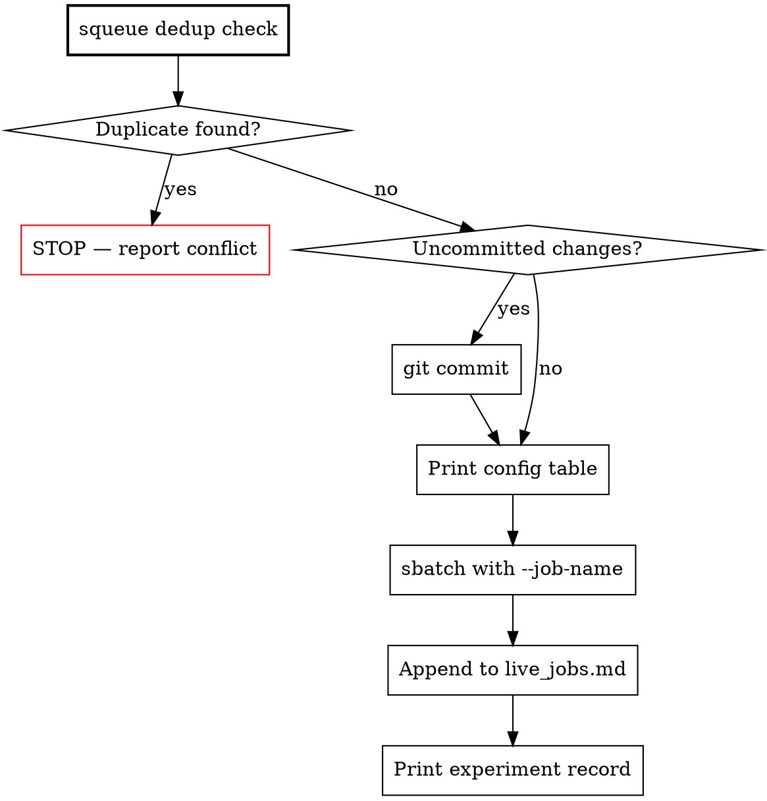

# Submit Job

Automate the full sbatch submission workflow: commit → sbatch → live_jobs append → experiment record.

## Workflow



## Steps

### 0. Dedup Check (MANDATORY — before everything else)

**Every submission MUST start with a duplicate job check.** This is non-negotiable.

```bash
squeue -u kangli.s5e -o "%.10i %.25j %.8T %.12M %.6D %R"
```

For each running/pending job, compare against the job you're about to submit:
- **Model config**: architecture (S5/GDN), d_model, n_layers, params
- **Data**: tickers, date range, encoding (P1a/P1b/P1c/MarS)
- **Training**: seq_len, BSZ, LR, optimizer

**If any existing job matches the same model + data + encoding → STOP. Do NOT submit.**

Report the dedup check result to the user:
```
Dedup check: N jobs running. No conflicts found. ✅
```
or:
```
⚠️ DUPLICATE DETECTED: Job <ID> (<name>) is running the same config.
  → Do NOT submit. Use the existing job or cancel it first.
```

**Why this rule exists:** Job 3253421 (fresh start) ran in parallel with 3260152 (resume of same GDN 94M config) for 13h, wasting 16N × 13h = 208 node-hours.

**Resume chain awareness:** Before submitting a fresh-start job, check if there's an existing checkpoint chain for the same experiment. If yes, resume from checkpoint instead of starting fresh.

**Optional local verifier:** If normalized metadata is already available, run the scaffold-evolution duplicate guard before `sbatch` and follow its decision:

```bash
python3 execution-layer/scaffold-evolution/verifiers/duplicate_slurm_job_guard.py \
  --input <normalized-job-case.json> \
  --strategy fingerprint_intent_checkpoint
```

The input should contain `pending_submission`, `live_jobs`, and `checkpoint_chains` either at the top level or under `case`. This helper supplements the mandatory `squeue` check; it does not replace human review when metadata is missing.

### 1. Commit Check
```bash
cd <worktree>
git diff --quiet && git diff --cached --quiet || echo "UNCOMMITTED CHANGES"
```
If uncommitted: `git add` + `git commit` with conventional commit message. **Never sbatch with dirty tree.**

### 2. Config Table
Print key parameters for user confirmation (per sbatch checklist rule):
```
| Parameter | Value |
|-----------|-------|
| Job name  | ... |
| Nodes     | ... |
| GPUs      | ... |
| BSZ/GPU   | ... |
| Time      | ... |
| ...       | ... |
```

### 3. sbatch
```bash
sbatch --job-name=<name> [--time=HH:MM:SS] [--contiguous] [--nodes=N] <script.batch>
```
Rules:
- `--job-name` format: `ctx{orders}k-{nodes}n-{time}h` or descriptive name
- `--contiguous` for ≤4 nodes only
- `--time=00:30:00` for test jobs
- **>12h AND >2 nodes** requires user confirmation

### 4. Append to live_jobs.md
**Append-only** using `cat >>`. NEVER read/edit the file.

```bash
cat >> /projects/s5e/quant/AlphaTrade/experiments/live_jobs.md << 'EOF'

Job:   <JOBID> (<job-name>)
User:  <username>
Step:  0/<total>  [░░░░░░░░░░░░░░░░░░░░░░░░░░░░░░]  0%
Model: <model description> | <params> params
Data:  <data description>
Infra: <nodes>N / <gpus> GPU | BSZ=<bsz>/gpu, gBSZ=<gbsz>
LR:    <lr>
Loss:  (pending)
Speed: ~<est> s/step
Time:  0:00 elapsed  |  ~<est>h remaining  |  <limit> limit
ETA:   ~<est>h total
W&B:   (pending)
Log:   <full log path>

Updated: <YYYY-MM-DD HH:MM:SS UTC>
EOF
```

### 5. Experiment Record
Print the standard 3-item table:
```
┌────────┬──────────────────────┐
│ Field  │         Value        │
├────────┼──────────────────────┤
│ Job ID │ <SLURM Job ID>       │
├────────┼──────────────────────┤
│ Log    │ <full log path>      │
├────────┼──────────────────────┤
│ W&B    │ (pending)            │
└────────┴──────────────────────┘
```

### 6. Post-Submit Auto-Check (MANDATORY)

**Every sbatch must be followed by a background monitor** that checks at 1min / 5min / 15min / 30min:

```bash
JOBID=<id>
LOGFILE=<log_path>

for CHECKPOINT in 60 300 900 1800; do
    sleep $CHECKPOINT
    STATE=$(squeue -j ${JOBID} -h -o "%T" 2>/dev/null || echo "DONE")
    MINS=$((CHECKPOINT / 60))

    if [ "$STATE" = "DONE" ]; then
        EXIT=$(sacct -j ${JOBID} --format=ExitCode -n | head -1 | xargs)
        echo "=== ${MINS}min check: DONE (exit ${EXIT}) ==="
        # If failed, show error
        [ "$EXIT" != "0:0" ] && grep -iE "error|oom|assert" "$LOGFILE" 2>/dev/null | tail -5
        break
    fi

    echo "=== ${MINS}min check: ${STATE} ==="
    case $CHECKPOINT in
        60)   # 1min: crash check
              grep -iE "error|oom|fatal" "$LOGFILE" 2>/dev/null | tail -3 ;;
        300)  # 5min: compile check
              grep -v "sol_gpu_cost_model" "$LOGFILE" 2>/dev/null | grep -E "it/s|compile|Timing" | tail -2 ;;
        900)  # 15min: speed + loss check
              grep -v "sol_gpu_cost_model" "$LOGFILE" 2>/dev/null | grep "\[Timing\]" | tail -1 ;;
        1800) # 30min: full /check format
              # invoke /check skill or print progress bar
              grep -v "sol_gpu_cost_model" "$LOGFILE" 2>/dev/null | grep "\[Timing\]" | tail -3 ;;
    esac
done
```

Run with `run_in_background=true`. This is **not optional** — every sbatch triggers this.

### 7. Save Monitor State (for /moveon reconnect)

**Immediately after launching the background monitor**, append to the tracking file so `/moveon` can restore monitors after session reconnect:

```bash
MONITORS_FILE="/projects/s5e/quant/AlphaTrade/LOBS5/.claude/active_monitors.jsonl"
echo '{"job_id":"'"${JOBID}"'","name":"'"${JOBNAME}"'","log":"'"${LOGFILE}"'","ts":"'"$(date -u +%Y-%m-%dT%H:%M:%SZ)"'"}' >> "${MONITORS_FILE}"
```

This is the "save" side of the record-and-replay protocol. Without this, `/moveon` has nothing to restore.

## Common Mistakes

| Mistake | Fix |
|---------|-----|
| **Submitting without dedup check** | **ALWAYS `squeue` first — check for duplicate configs** |
| **Fresh start when resume chain exists** | **Check checkpoints for same experiment before starting fresh** |
| sbatch with uncommitted changes | Always `git commit` first |
| Forgetting `--job-name` | Every job needs a descriptive name |
| Reading live_jobs.md | **Append-only** — never read or edit |
| Missing `User:` field | Required to distinguish kangli.s5e / aramis.s5e |
| `--contiguous` on >4 nodes | Only use for ≤4 nodes |
| Forgetting Step 7 (save monitor) | `/moveon` needs tracking data to restore monitors after reconnect |
